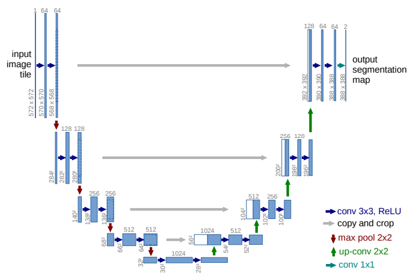

<h1 align="center">Face Blurring Unet Thesis</h1>
  
## Table of contents
- [Introduction](#introduction)
- [Dataset structure](#dataset-structure)
- [Model architecture](#model-architecture)
- [Training](#training)
- [Results](#results)
- [Performance](#performance-assesment)
- [Conclusion and Future Work](#conclusion-and-future-work)

# Introduction
This repository contains the code and the information from a thesis work about face blurring.
The goal is to develop a working face blurring model using a U-Net structure, based on an encoder-decoder architecture. To do that hardware limitation of embedded devices have to be considered, so the aim is to develop a model with a final size of more or less 1MB and verify the inference time on a board using a board simulator to see wheter it can be fitted on a TinyML device or not and the inference time to asses if it can perform real-time inference. The dataset of images is restricted to contain only medium/large size faces to allow the model to perform better on this type of inputs.

# Dataset structure
The training dataset is composed of four different folders and is organized in two different types of folders: training and validation. The total number of images of the dataset is 12000 and they are then divided 80% for training(9600), and 20% for validation. The images are in .jpg format.
Another important aspect to consider is that images have to be processed as pairs during training so it is really important that the dataset is produced in a way that an image has the same name both in the original and in the blurred folder of the dataset to be then loaded in an ordered way during training. In the files used to blur the dataset, whcih are dataset_blur_blazeface.py and dataset_blur_mediapipe.py there is the possibility to rename the images to obtain a zero padded format like the one presented in the structure below, using an automatic function to calculate the number of zeros needed or giving it as a manual input. This is not a mandatory task but it helps to keep the dataset clean and understandable and with the five zero padded structure chosen for this implementation it can also be expanded easily just by following this nomination technique.
The structure of the dataset is the following:
```
┣ dataset
┃ ┣ train
┃ ┃ ┣ 00001.jpg
┃ ┃ ┣ ...
┃ ┃ ┣ 09600.jpg
┃ ┣ train_blur
┃ ┃ ┣ 00001.jpg
┃ ┃ ┣ ...
┃ ┃ ┣ 09600.jpg
┃ ┣ val
┃ ┃ ┣ 00001.jpg
┃ ┃ ┣ ...
┃ ┃ ┣ 02400.jpg
┃ ┣ val_blur
┃ ┃ ┣ 00001.jpg
┃ ┃ ┣ ...
┃ ┃ ┣ 02400.jpg
```

There are 2 verison of the dataset.
Both are composed of images extracted randomly and then selected by hand from the dataset [VGGFace2](https://www.kaggle.com/datasets/hearfool/vggface2) in the cropped version 256x256 found on Kaggle website, images from [FDDB](https://www.kaggle.com/datasets/cormacwc/fddb-dataset) dataset from Kaggle website(more or less 20%) and images from [CelebA-HQ](https://www.kaggle.com/datasets/badasstechie/celebahq-resized-256x256) in a 256x256 version(10-12%) from Kaggle website

To produce the structure above the images have been divided into train and val folder and then with the help of a face detector blurring has been performed on them to generate train_blur and val_blur folders. Two different detectors have been used:
- [BlazeFace-TFLite-Inference](https://github.com/ibaiGorordo/BlazeFace-TFLite-Inference)
- [Mediapipe](https://mediapipe.readthedocs.io/en/latest/solutions/face_detection.html) official implementation

Both implementation seem to perform weel but they still miss some faces, especially on images where the face is too big, when it is only half face or when there are multiple faces and some of them are small or low resolution.
That said the mediapipe implementation has been chosen for the first dataset since it is an official implementation, even if the blocks of the architecture should be very similar between the two models. 
After a close check to the results there were some missed faces, so the decision was to realize a second version of the datase, by running the blazeface detector over the blurred images from the mediapipe one, and then clean up the validation folder by hand to be sure that it is perfect since this impacts directly the metrics. Then all the folders have been padded with black padding to the input size of the model, 128x128, to avoid stretched images during training, since the file uses a resize function without padding.

The versions of the datasets are available at the following links:
- [dataset1](https://drive.google.com/drive/folders/1nc2RxoH2I2nXbIiicZD8KBU1zQQUWBJD?usp=sharing), [dataset1 zip](https://drive.google.com/file/d/1x5ATVlCTmYPZ24dOTgq-wUrLTqsGatCW/view?usp=drive_link)
- [dataset2](https://drive.google.com/drive/folders/1wqO6618ofLW8gB9EpMY_0mKAMW9D5pmD?usp=drive_link), [dataset2 zip](https://drive.google.com/file/d/1xL5uTMsSbD9dynzjN-AHahwejFW7vyf-/view?usp=drive_link)

For further improvements a recommendation is to use a labeled dataset where there is an annotation file containing the boxes of the faces. It will be even better if the label are ellipses instead of boxes or if they can be converted to them with some processing. This last improvement will bring to a more clean and precise result, but for the scope of this research, and for time constraints, this type of process and dataset has been chosen.

[Back to top](#table-of-contents)

# Model architecture
The model architecture is based on a simple unet structure, which is a convolutial network with a downsample(encoder) and an upsample(decoder) path. This type of path is common in image reconstruction or detection tasks.
In specific the architecture of the model in analysis is a 3 layer encoder and 3 layer decoder architecture wirh the following filters: 32-64-128 for encoder, and opposite for the decoder. The bottleneck(deppest point of the network) has 256 filters.
<div align="center">
  <figure>
    
    <figcaption><b>Figure 2:</b> U-Net architecture</figcaption>
  </figure>
</div>

The resulting models are of two types: teacher and student, since to try reducing the size even more, knowledge distillation was applied. All the models have 3 layers as said before, the different stand in the size of the filters, which is halv in the studentv1 model, so 16-32-64 and 128 as bottlenck, while for studentv2 is 24-48-96-192.
```
Conv Block (`conv_block`) = 2× 2DConv + BatchNorm + ReLU

**Architecture:**
Input
│
Encoder:
├─ c1 = conv_block(inputs, 32)
├─ p1 = MaxPooling2D(2,2)
├─ c2 = conv_block(64)
├─ p2 = MaxPooling2D(2,2)
├─ c3 = conv_block(128)
└─ p3 = MaxPooling2D(2,2)

Bottleneck:
└─ bn = conv_block(256)

Decoder:
├─ d3 = Conv2DTranspose(128) → Concatenate(c3) → conv_block(128)
├─ d2 = Conv2DTranspose(64) → Concatenate(c2) → conv_block(64)
└─ d1 = Conv2DTranspose(32) → Concatenate(c1) → conv_block(32)

Output:
└─ outputs = Conv2D(3, (1,1), activation='sigmoid')

```
[Back to top](#table-of-contents)

# Training 
Training was performed using T4 GPU on Google colab. The file for the teacher model training is train_teacher.py, while the one for the student training is train_student.py.
It is possible to use the pretrained models for inference(tflite versions) or even to perform retraining from scratch or fine tuning. To do this there is the training notebook available: [](https://colab.research.google.com/drive/1H3IJpvMuoR8DHG3eG32bgsEw3pUlPiyM?usp=sharing)
It is important to remember that when training on Colab it is better to have the dataset in local(for example in the /content folder), otherwise the I/O procedure from Drive can slow the training importantly.

To perform retraining there is the need to pull this directory and download the dataset. Then there is the possibility to train the teacher first, and then the student and perform a single image test or a complete test using one of the [testsets](https://drive.google.com/drive/folders/1Hn19eYKDg3o819H9MJytOBQyxTc9aUpO?usp=sharing).

KNOWLEDGE DISTILLATION TRAINING
Knowledge distillation is an effective technique in machine learning for adapting or compressing models with identical input and output, even if they have a slightly different structure. It is based on the presence of a teacher and a student model. The last one learns to replicate the teacher's output
For the students model training the training file is train_student.py and it contains a class called Distiller that defines the metrics used based on the knowledge distillation technique:

<div align="left">
  <figure>
    
    <figcaption><b>Figure 2:</b> KD loss functions</figcaption>
  </figure>
</div>

The teacher is set as non-trainable and the loss functions for training and validation are still based on MSE, but the total loss is a weighted combination between the loss of the student and the loss between the student and the teacher outputs. The parameter alpha can be tuned to increase or decrease the impact of the teacher. In this case alpha is set to 0,7, so the teacher impact is 0,3.


To try only the inference part, the .tflite models in the different models folders in this repository can be used. Instructions are inside the following script: 
[](https://colab.research.google.com/drive/1H3IJpvMuoR8DHG3eG32bgsEw3pUlPiyM?usp=sharing) (link needs to be changed)

QUANTIZATION
Quantization is a model compression technique that aims to reduce the memory footprint and computational requirements of neural networks. It operates by representing the model parameters and activations with a lower numerical precision, typically passing from 32 bit floating point (FP32) to 16 bit or 8 bit integer (INT8) formats. This reduction comes at the cost of potential degradation in model accuracy depending on the quantization method and the model's sensitivity to these changes. 
For this project post training quantization is used, since the aim of the project is not to maximize the performance but to understand the memory footprint and possible performance of the models. 


RESULTING MODELS
| Model        | Type             | Size (KB) |
|--------------|-----------------|-----------|
| **Teacher**  | .keras           | 22,819    |
|              | .tflite (float32)| 7,535     |
|              | .tflite (int8)  | 1,938     |
| **Studentv1**| .keras           | 2,078     |
|              | .tflite (float32)| 1,896     |
|              | .tflite (int8)  | 507       |
| **Studentv2**| .keras           | 4,432     |
|              | .tflite (float32)| 4,247     |
|              | .tflite (int8)  | 1,106     |


[Back to top](#table-of-contents)

# Results
In this section training graphs of the loss will be shown. The loss used is MSE and the other metrics are MAE, SSIM and PSNR. The 2 lines indicates the the training phase(BLUE) and the validation phase(RED).
<div align="center">
  <figure>
    
    <figcaption><b>Figure 2:</b> Teahcer loss chart</figcaption>
  </figure>
</div>

| Type  |      MSE |  val_MSE |     MAE | val_MAE |   SSIM | val_SSIM |   PSNR | val_PSNR |
|-------|---------:|---------:|--------:|--------:|-------:|---------:|-------:|---------:|
| teacher | 0.000221 | 0.000519 | 0.00971 | 0.0110  |  0.974 |    0.959 |  36.97 |    34.19 |

| Type       | Loss KD   | val_loss | MAE     | loss_gt | val_loss_gt | loss_distill | val_loss_distill |  PSNR |  SSIM |
|------------|----------:|---------:|--------:|--------:|------------:|-------------:|----------------:|------:|------:|
| Studentv1  | 0.000168 | 0.000395 | 0.0157  | 0.000416 | 0.000460   | 0.000257     | 0.000242        | 32.04 | 0.941 |
| Studentv2  | 0.000249 | 0.000367 | 0.0130  | 0.000284 | 0.000434   | 0.000167     | 0.000210        | 33.18 | 0.950 |


[Back to top](#table-of-contents)

# Performance assessment
To understand the performance of the models, different testsets are used. The concept is to use images from different datasets to understand where the model might have difficulties or fails.
These datasets considered were the following, and most of them have already been used in the training part:
- VGGFace2: same characteristics as the majer part of the images used in the training and validation set, has multiple faces images and the size of the faces is various
- Celeba-HQ: has more centered and aligned images with bigger faces
- FDDB: as for the one in the training, a derivation of this dataset has been used since the official site is not working at the moment. Like VGGFace2 it has multiple faces and different dimensions
- WIDER Faces: very diversified an big dataset, it contains images with a lot of small faces and images with bigger ones.

Testsets are not generated randomly, images have been selected with the purpose to understand and asses the performance of the model in different scenarios. For the purpose of this project images with a very high number of faces, and images where the dimension of them is too small, have been avoided. Since the dataset used for training doesn't contain none of them, the performance on this kind of images is expected to be bad and goes out of the scope of the project, which doesn't aim for a perfect performance on every type of image since the model has a small amount of parameters and a limited training dataset.

The first test set uses the images from CelebA-HQ to asses the anonymization level of the model on big faces. This is done using the buffalo_l model form insightface library to extratct the embedding features on both the original and the elaborated image and measure the cosine similarity. The target is to reach a level of similarity lower than 0,4.
The second and third testsets use images relatively from FDDB and Widerfaces datasets, divided into four folders:
- Frontal faces: containing images of big frontal faces;
- Medium faces: containing images of medius size faces;
- Multiple faces: containing images of big and medium size faces;
- Difficult cases: containing scenarios that can lead the model to failure easily, such as beards, glasses, dark skin people and small faces. 

During the test with FDDB testset, what emerged was that all the models work better on frontal an big/medium faces images. As can be seen in the figure below, the teacher model has cleaner and more natural blur while the studentv2 gets more aggressive in the blur and studentv1, which is the smaller, tents to blur bigger regions. Especially what happens with the two students is that they also blur parts of the image containing the hands or the neck, such as in image 1,2,3. This effect is lighter studentv2, while it gets worse in the smaller model. This can be caused by the reduction of the parameters, which is important and so the model may be misled by the color of the hand. Also in the dataset only a percentage close to 20\% of the training images contain hands, so this may be a factor to improve. Other situations where the model is in difficulty is when there are sunglasses, especially bigger ones, with darker skin colors and medium/small faces, and when medium/small size faces are partially obscured by accessories like baseball hats. In some cases, especially with medium or smaller faces sometimes the model does not see the face or blurs it only partially.
The WIDER faces based testset is more difficult for the designed model, because the resolution of the images is way bigger, sometimes also over 1000x1000, and most of them are not square, so what happens when the images are padded is that the size of the faces gets really small and the models struggle to detect them. To conclude, performance for the faces that remain in large/medium size is still good, while it is drastically reduced with smaller dimensions. For these reasons, images are not displayed because the situations with good results are the same as the FDDB testset.

Tests shown in the images above are performed using non-quantized versions of the models to asses their starting performance and avoid the influence of the performance loss given by the quantization process. During the test with FDDB testset, what emerged was that all the models work better on frontal an big/medium faces images. Images are referenced in this paragraph starting with numbers 1 to 4 top to bottom for Figure..., and 5 to 8 for Figure.... Generally speaking it has been noticed that all the models sometimes miss some faces or only partially obfuscates them, especially the medium/small and the lateral ones. It has also been noticed that when one model misses, usually at least one of the others behaves differently and is able to either completely or partially blur the face. An example of this is image 8, where the teacher and studentv1 partially misses the first face, while studentv2 is able to blur all three faces.
Talking about image 1 the visual differences are really low, what appears is that the blur on large faces is too light, as stated in the DATASET SECTION this was expected and will be analyzed later. In image 2 the performances are good, but studentv2 blurred also the hand region, this situation happened also in some other images, such as image 5, and is not a specific problem of the studentv2, but affects also the others. This might be due to the reduced presence of hands in the training set. In image 3 it can be noticed that the teacher model has a higher reconstruction quality, while the other tent to lose some details in the central region. Another critical case is when the subject wears glasses or a hat, such as in image 4, in this case the teacher model performs well, while the others struggle to blur the face completely, especially studentv1. In image 6 the teacher results seems to be more precise and in image 7 the outputs are similar, only a small difference in the blurring intensity is perceived.
The WIDER faces based testset is more difficult for the designed models, because the resolution of the images is way bigger, sometimes also over 1000x1000, and most of them are not square, so what happens when the images are resized is that the dimension of the faces could get really small and the models struggles to detect them and fails. To conclude, performance for faces that remain in large/medium size is still good, while it is drastically reduced with smaller dimensions. For these reasons, images are not displayed because the situations with good results are the same as the FDDB testset.


Model parameters, RAM usage, MMAC and inference time on STM32N6570-DK:
| Model        | Parameters     | RAM           | MMAC           | Inference    |
|--------------|---------------|---------------|----------------|-------------|
| **Teacher**  | 1,925,667 (1.84 MiB) | 2,150,600 B (2.05 MiB) | 2,609,694,307 | 351.007 ms |
| **Studentv1**| 482,067 (473.17 KiB) | 1,065,096 B (1,040.13 KiB) | 656,851,763  | 12.786 ms  |
| **Studentv2**| 1,083,675 (1,061.87 KiB) | 1,614,232 B (1.54 MiB) | 1,471,268,043 | 127.981 ms |

The table show the results obtained on test performed with ST Edge AI Developer Cloud. The board used has slightly higher specs than a common MCU and has a ST Neural-ART Accelerator, that allows to have better inference, especially when using operations such as 2D convolutions and using this allows to deploy also the teacher model. Results are quiet good, however, the hardware accelerator does most of the job, because some tests on lower power MCUs showed that inference takes more than 2 seconds due to the size of the student model, which is still big, and to the complexity of the 2D convolutions used in the architecture. Lighter layers using deptwise separable convolution were tested, but they seemed to perform worse on the visual test, so they are not proposed in the solution.

[Back to top](#table-of-contents)

# Conclusion and Future Work
To conclude the designed approach works quiet good on large/medium size faces, still having some missed or partially blurred faces. The project can be useful to understand how this type of models work, how an image to image training is performed and the possible difficulties and things to improve when dealing with this architectures. 
There is still a lot of room for improvements, performing more tests with differen number of layer and filters and using lighter blocks designed for embedded devices, which provide faster inference and less energy consumption. Also quantization aware training would be an interesting approach to try in the future to see wheter the accuracy loss is reduced when quantizing the model.
This type of approach might seem controversial considering the limitation of embedded devices, and the high memory footpring and computational impact that and encoder-decoder network can have, but it is very interesting to verify these parameters and think of possible future improvements. An interesting path to consider is usign a pre-trained lightweight face detector as a backbone to detect the faces, so only the decoder part can be trained to blur based on the output of the backbone, while keeping the encoder weights freezed. Other improvements on the dataset side may be expanding the dataset adding variety, using ellipses for blurring instead of boxes, and using labeled images to reduce the presence of possible non blurred faces in the training data. 

